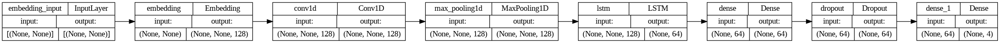

# News Genre Classification

## Overview

In this project, we developed a Deep Learning model to automatically classify news articles into predefined categories such as sports, politics, business, and entertainment. We preprocessed the text data by tokenizing, removing stopwords, and encoding it using word embeddings. Our model, trained on a labeled dataset of news articles, achieved high accuracy in categorizing articles, providing a valuable tool for organizing and analyzing large volumes of news content.

## Requirements

- `numpy`
- `pandas`
- `nltk`
- `sklearn`
- `tensorflow`
- `matplotlib`

## Data Preprocessing

We loaded the dataset and performed preprocessing steps which include lower casing, tokenization, stopwords and punctuation removal, and stemming.

## Data Visualization

Visualizing the Class Distribution, Article length distribution, and the top 10 most common words in each class.

## Model Training and Evaluation

### Model Architecture

### Tokenization and Padding

Tokenization and padding were performed to prepare the text data for model training.

### Model Definition

The model architecture consists of an Embedding layer, a Conv1D layer, a MaxPooling1D layer, an LSTM layer, Dense layers, and a Dropout layer.

### Model Compilation and Training

We used the Adam optimizer and sparse categorical crossentropy loss for compiling the model. The model was trained for 25 epochs with early stopping to prevent overfitting.

### Evaluation

The model's performance was evaluated on the test dataset and achieved high accuracy.

## Saving the Model

The best model from the training is saved in `.h5` format for future use.

## Model Testing

In this section, the user can test the model by running it on a specific record from the testing dataset.
